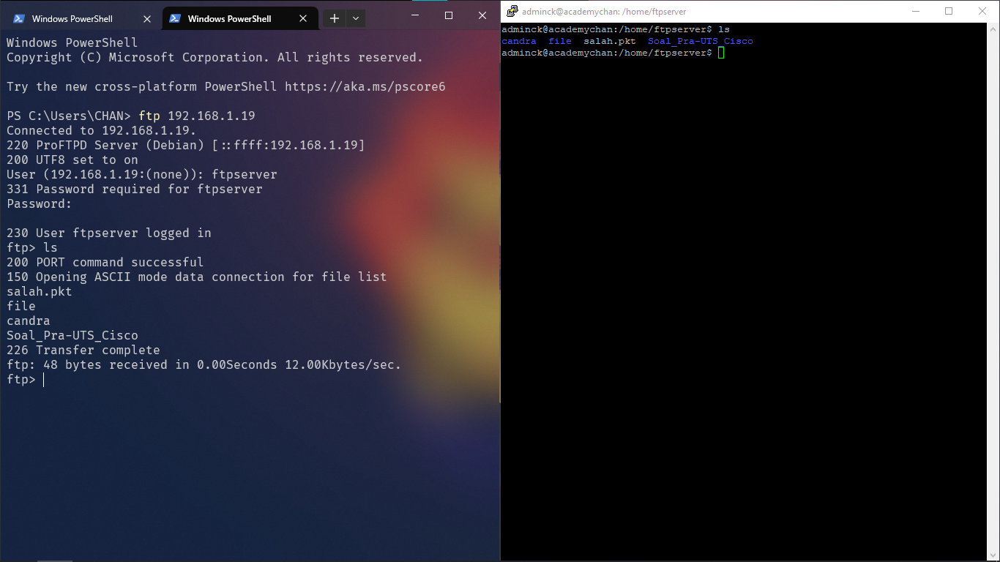

# **Panduan Instalasi & Konfigurasi ProFTPD di Debian Server**  

## **Dibuat oleh Kelompok B6 :**  
> 👩‍💻 **Candra Kirana (233040037)**  
> 👨‍💻 **Ananda Rizky Maulana (233040058)**  
> 👨‍💻 **Aidil Fikri (233040059)**  

---

## 📋 **Pendahuluan**  
ProFTPD adalah server FTP yang andal, fleksibel, dan mudah dikonfigurasi untuk menyediakan layanan FTP di sistem berbasis Linux. Dokumentasi ini memberikan panduan langkah demi langkah untuk menginstal, mengonfigurasi, dan menggunakannya pada Debian Server.  

---

## 🚀 **Langkah Instalasi**  

### 🔧 **1. Update Sistem**  
Perbarui paket sistem untuk memastikan lingkungan Anda siap:  
```bash
sudo apt update && sudo apt upgrade -y
```

### 📦 **2. Instal ProFTPD**  
Jalankan perintah berikut untuk menginstal ProFTPD:  
```bash
sudo apt install proftpd -y
```  

**⚙️ Pilihan Mode Instalasi:**  
Pilih mode **Standalone** saat diminta selama proses instalasi.  

### ✅ **3. Verifikasi Instalasi**  
Cek apakah layanan ProFTPD sudah berjalan:  
```bash
sudo systemctl status proftpd
```  

Jika belum berjalan, jalankan perintah ini untuk memulai dan mengaktifkan layanan secara otomatis:  
```bash
sudo systemctl start proftpd
sudo systemctl enable proftpd
```  

---

## ⚙️ **Konfigurasi ProFTPD**  

### 🛠️ **1. Edit File Konfigurasi**  
Buka file konfigurasi ProFTPD:  
```bash
sudo nano /etc/proftpd/proftpd.conf
```  

Tambahkan atau edit pengaturan berikut:  
```conf
# Mengizinkan lebih banyak proses
MaxInstances 50

# Mode pasif konfigurasi
PassivePorts 30000 35000

# Root direktori default untuk pengguna
DefaultRoot ~

# Izinkan login tanpa shell yang valid
RequireValidShell off
```

**(Opsional)**: Konfigurasi untuk FTP anonim:  
```conf
<Anonymous ~ftp>
  User ftp
  Group nogroup
  UserAlias anonymous ftp
  RequireValidShell off
  <Directory *>
    <Limit WRITE>
      DenyAll
    </Limit>
  </Directory>
</Anonymous>
```

### 🔄 **2. Restart Layanan**  
Restart untuk menerapkan perubahan konfigurasi:  
```bash
sudo systemctl restart proftpd
```

### 👤 **3. Tambahkan Pengguna FTP**  
Buat pengguna baru untuk akses FTP:  
```bash
sudo adduser ftpserver
```  

### 📁 **4. Buat Direktori FTP (Opsional)**  
Atur direktori khusus untuk file pengguna FTP:  
```bash
sudo mkdir /home/ftpserver
sudo chown ftpserver:ftpserver /home/ftpserver
```

---

## 🌐 **Penggunaan FTP**  

### ⚙️ **1. Akses FTP Secara Lokal**  
Gunakan perintah berikut untuk menguji akses FTP lokal:  
```bash
ftp localhost
```  

Masukkan **username** dan **password** yang telah Anda buat.  

### 📡 **2. Akses FTP dari Perangkat Lain**  
1. **Cek IP Server:**  
   ```bash
   ip addr show
   ```
2. **Setel Jaringan di VirtualBox:**  
   - Gunakan mode **Bridged Adapter** pada pengaturan jaringan VirtualBox agar server dapat diakses dari perangkat lain.
     
3. **Buka Port di Firewall (Jika Diperlukan):**  
   ```bash
   sudo ufw allow 21/tcp
   sudo ufw allow 30000:35000/tcp
   sudo ufw reload
   ```  
4. **Gunakan FTP Client:**
- Di perangkat lain, instal aplikasi FTP client seperti **FileZilla** atau **WinSCP**.
- Hubungkan dengan parameter berikut:
  - **Host:** `192.168.x.x` (IP Server)
  - **Username:** `ftpserver`
  - **Password:** (yang telah dibuat)
  - **Port:** `21`

### 📥 **3. Upload dan Download File**  
  - **Upload File:** Drag-and-drop file ke direktori server pada aplikasi FTP client.
  - **Download File:** Klik kanan pada file di server dan pilih **Download**.

---

## 🔒 **Opsional : Aktifkan FTP Aman (FTPS)**  

1. **Instal Modul TLS:**  
   ```bash
   sudo apt install proftpd-mod-tls
   ```  

2. **Konfigurasi TLS:**  
   Edit file TLS:  
   ```bash
   sudo nano /etc/proftpd/tls.conf
   ```  
   Tambahkan path sertifikat SSL Anda.  

3. **Restart ProFTPD:**  
   ```bash
   sudo systemctl restart proftpd
   ```  

---

## 💡 **Pemecahan Masalah**  

| **Masalah**                          | **Solusi**                                                                                   |
|--------------------------------------|---------------------------------------------------------------------------------------------|
| Tidak bisa terhubung                 | Pastikan adapter jaringan di VirtualBox diset ke **Bridged Adapter** dan periksa IP server. |
| Login gagal                          | Verifikasi username dan password. Pastikan layanan ProFTPD sedang berjalan.                 |
| FTP Client tidak bisa koneksi pasif  | Pastikan port 30000-35000 terbuka di firewall.                                              |

---

## 🎉 **Dokumentasi Berhasil**  
Selamat! Anda telah berhasil menginstal dan mengonfigurasi ProFTPD di Debian Server.  

**Contoh Output:**  
 

**Kelompok B6 Mengucapkan Terima Kasih!** 🙌
